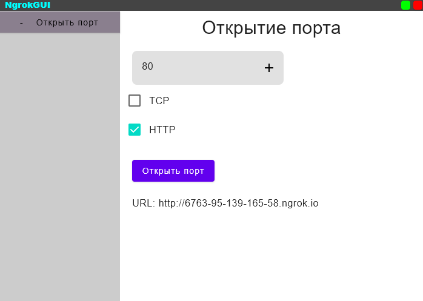

# NgrokGUI

Минимальный графический интерфейс для Ngrok на Jetpack Compose Kotlin

## Screenshots




## Run

* Install jre11
* Go to releases
* Download release
* ```bash
  /path/to/jre11/java.exe -jar NgrokGUI-windows-x64-1.0.0.jar
  ```
    
## Installation

* Go to releases
* Download release for your os
* Install
